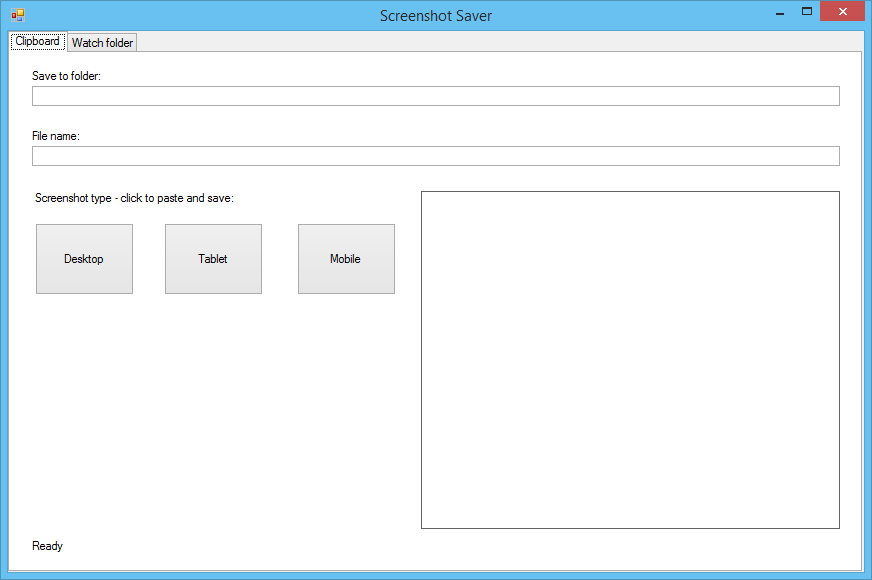
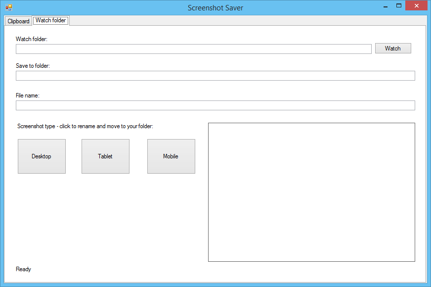

[](https://itln.visualstudio.com/Screenshot%20Saver/_build?definitionId=1&branchName=master)   

# Screenshot Saver

Application to streamline saving test evidence screenshots.

It consists of two tabs:
* Clipboard
* Watch	folder


## Clipboard



Example routine:
* go to page A
	* change to Desktop view
		* take screenshot
	* change to Tablet view
		* take screenshot
	* change to Mobile view
		* take screenshot
* go to page B
	* repeat...

How this tool helps?

* in **Save to folder** field enter the folder where all screenshots will be stored
* go to page A
	* type page name in **File name** field
	* change to Desktop view
		* take the screenshot and put it to clipboard (there are many screenshot tools that automatically put taken screenshot to the clipboard)
		* click the **Desktop** button - the screenshot will be saved to the **Save to folder** folder with the name `name - size.png`.
	* change to Tablet view
		* take the screenshot and put it to clipboard
		* click the **Tablet** button
	* do the same for Mobile
* go to page B
	* type new page name in **File name** field
	* take screenshots and use the buttons to save them


## Watch folder



This mode works similarly to the previous one.
Instead of taking screenshots from the clipboard, they are taken from the file system by watching a folder.

How this tool helps?

* enter the folder that should be monitored for new screenshots in **Watch folder**
	* press the **Watch** button
* in **Save to folder** field enter the folder where all screenshots will be stored
* go to page A
	* type page name in **File name** field
	* change to Desktop view
		* take the screenshot (the screenshot tool you use should save the PNG screenshot to the folder you set in **Watch folder**)
		* click the **Desktop** button - the screenshot file will be moved to the **Save to folder** folder with the name `name - size.png`.
	* change to Tablet view
		* take the screenshot
		* click the **Tablet** button
	* do the same for Mobile
* go to page B
	* type new page name in **File name** field
	* take screenshots and use the buttons to save them


## Developer's highlights

* monitoring a folder for changes (new files, modified files, deleted files)
* avoiding locking an image file by application

Code:
https://github.com/lukaszmn/Screenshot-Saver/blob/master/Screenshot%20Saver/WatchPanel.cs

```csharp
private void watch() {
	try {
		if (watcher != null) {
			watcher.Changed -= new FileSystemEventHandler(watcher_Changed);
			watcher.Dispose();
		}

		watcher = new FileSystemWatcher();
		watcher.Path = uWatchFolder.Text;
		watcher.NotifyFilter = NotifyFilters.LastAccess | NotifyFilters.LastWrite
								| NotifyFilters.FileName | NotifyFilters.DirectoryName;
		watcher.Filter = "*.png";
		watcher.Changed += new FileSystemEventHandler(watcher_Changed);
		watcher.EnableRaisingEvents = true;
	} catch (Exception ex) {
		MessageBox.Show(ex.ToString());
	}
}


private void watcher_Changed(object source, FileSystemEventArgs e) {
	if (e.ChangeType == WatcherChangeTypes.Deleted) return;

	string path = e.FullPath;
	try {
		Image image = null;
		// avoid locking the file
		using (var bmpTemp = new Bitmap(path)) {
			image = new Bitmap(bmpTemp);
		}

		uPicture.Invoke(new Action(() => setInfo(image, "New image: " + path)));
		discoveredPath = path;
	} catch (Exception) {
		uPicture.Invoke(new Action(() => setInfo(null, "")));
		discoveredPath = null;
	}
}
```